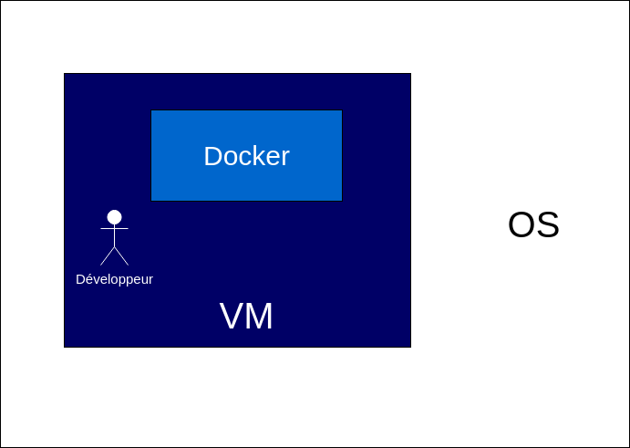
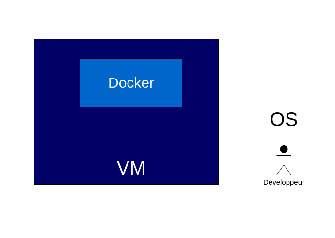

# Introduction

> **ATTENTION**: Ce tutoriel s'applique plus particulièrement aux **utilisateurs de Windows** rencontrant des soucis avec Docker.

Le problème pour utiliser Docker sur Windows est sa **configuration difficile.** (gestion de *l'Hyper-V*, gestion des permissions...)

D'ailleurs, le principal frein est que s'il s'agit d'une version de Windows non professionnelle, il est impossible d'installer Docker.

Voici une liste non exhaustive des alternatives possibles : 

| Méthode       | Avantage     |Incovénient|
| :------------- | :----------:| :----------:|
|  Linux en **dualboot** | Rapidité de Linux | Peu de flexibilité pour retourner sur Windows
|  Linux en **VM**  | Flexibilité entre OS | Lenteur pour travailler sur une VM

Vous l'aurez compris, la seule solution serait de passer par une distribution Linux. 

Si vous voulez garder la main sur Windows, optez pour la seconde option, mais développer sur une VM en même temps que de faire tourner Docker ne vous donnera pas les meilleures performances.

La solution serait alors de faire tourner **uniquement le Docker sur la VM** et garder la main sur **Windows pour le développement.**

